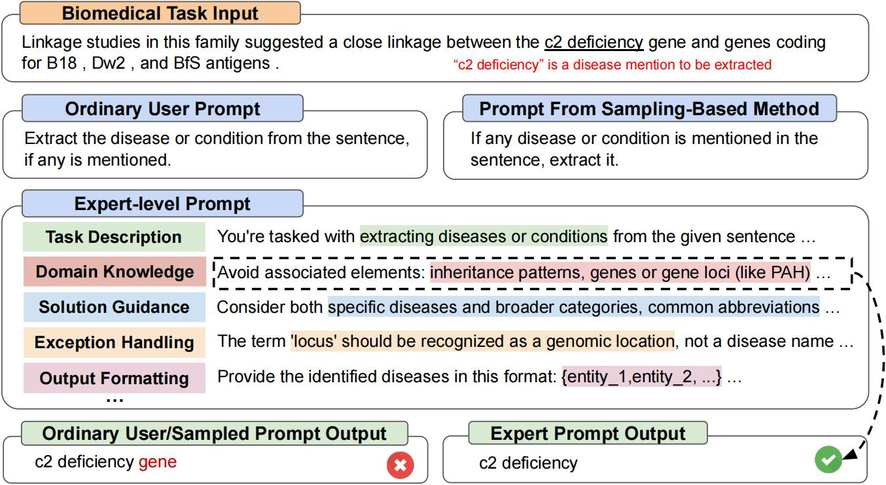
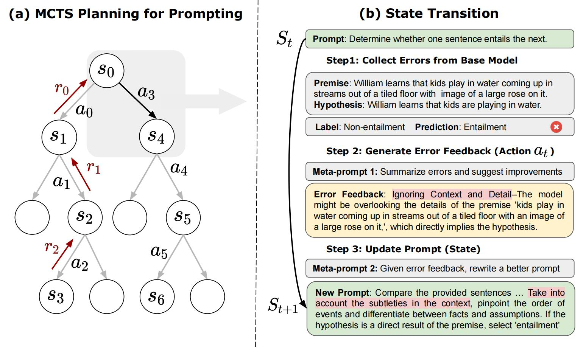

<p align="center">

</p>

## News
- Aug. 04, 2024: PromptAgent now support vllm LLMs, which speed up the local inference. Thanks Jiazheng for the commit!
- Jun. 27, 2024: LLM Reasoners library now integrates PromptAgent! See the **adapted PromptAgent** here: [Link](https://github.com/maitrix-org/llm-reasoners/tree/main/examples/PromptAgent/MedQA)
- May 17, 2024: Modify arguments control, use yaml file to set arguments for PromptAgent.
- May  15, 2024: Different models (openai, palm, huggingface models) are supported by PromptAgent.
- Jan. 16, 2024: PromptAgent has been accepted by ICLR 2024!  
- Dec. 17, 2023: Refined the code for ease of reading and use by users.
# PromptAgent


This is the official repo for "PromptAgent: Strategic Planning with Language Models Enables Expert-level Prompt Optimization".   PromptAgent is a novel automatic prompt optimization method that autonomously crafts prompts equivalent in quality to those handcrafted by experts, i.e., expert-level prompts. [[arXiv](https://arxiv.org/abs/2310.16427)]
<p align="center">

</p>
Unlike discovering magic/local prompt variants as existing prompt optimization methods, expert-level prompting is still an untapped area that solves challenging problems. And PromptAgent serves as a principled framework to study prompt optimization by unifying prompt sampling and rewarding using MCTS algorithm. 
<p align="center">

</p>

## Installation

```bash
git clone https://github.com/XinyuanWangCS/PromptAgent.git
cd PromptAgent
conda create -n prompt_agent
conda activate prompt_agent
pip install -r requirements.txt
```


## Quick Start

The following command run PromptAgent to craft an expert prompt for a BIG-bench task, [penguins_in_a_table](https://github.com/google/BIG-bench/tree/main/bigbench/benchmark_tasks/penguins_in_a_table). The running could take some time depending on the inference speed of OpenAI APIs and size of datasets. 

**Note**: Before running this command, please add your (OpenAI) api key to the example_config.yaml file (base_model_setting: api_key and optim_model_setting: api_key). You can also check all the other auguments in the yaml file.
```bash
python src/main.py --config_dir example_config.yaml 
```

`penguins_in_a_table` is an table understanding task to answer questions about animals contained in tables. An example from the original dataset looks like this:
```
Here is a table where the first line is a header and each subsequent line is a penguin:

name, age, height (cm), weight (kg)
Louis, 7, 50, 11
Bernard, 5, 80, 13
Vincent, 9, 60, 11
Gwen, 8, 70, 15

For example: the age of Louis is 7, the weight of Gwen is 15 kg, the height of
Bernard is 80 cm.

Which penguin is taller than the other ones? Answer:
```
Then, the expected result is `Bernard`.

The initial query from the BIG-bench dataset is `Answer questions about a table of penguins and their attributes.` Starting with such an ordinary prompt, PromptAgent will strategically sample model errors (from the base model), generate error feedbacks (actions), simulate future rewards, and search for high-reward paths leadning to expert prompts. The optimized prompt for `penguins_in_a_table` will look like this (exact results may vary as this is not deterministic):
```
As you delve into a dataset of penguins, assess essential attributes like names, ages, 
and gender. Decode the significance of each attribute in the context of every penguin 
while keeping in mind that the dataset may be modified, including addition or removal 
of penguins. When such modifications are made, immediately revise your understanding, 
redo your computations, and ensure that your subsequent calculations consider these 
changes. The crux of your task is to identify relationships and patterns within 
the attributes, giving special attention to the names and ages of the penguins.

For complex tasks, break them down into manageable chunks ensuring no essential detail 
is missed. When a change is made to the dataset, recompute your values taking into 
consideration these changes, paying extra attention to cumulative computations. Ensure 
that your understanding of ’more than’, ’less than’, and ’equal to’ is precise and 
that you correctly interpret these in context of the question.

...
```

It takes around two hours to run the above experiment, which costs around $5 using OpenAI API (around $4 for GPT-4 and $1 for GPT-3.5). After finishing the optimization, all the intermediate nodes and paths will be stored in a json file. We will keep the top-k reward nodes, the last node in the highest average reward path, and the highest reward node in the highest average reward path. In the paper, we use the highest reward node in the highest average reward path as the selection strategy. 

### Test
We can run `test.py` to test any prompt performance with the following commands:  
Enter the prompt in the command line:
```bash
python src/test.py --task_name bigbench --prompt "Answer questions about a table of penguins and their attributes." --prompt_file "prompt file path" --train_size 70 --eval_size 50 --test_size 79 --seed 42 --base_model_type "openai" --base_model_name 'gpt-3.5-turbo' --data_dir "datasets/penguins_in_a_table.json" --base_api_key "your_api"
```
or   
Put prompt in a .txt file if the prompt is very long:
```bash
python src/test.py --task_name bigbench --prompt_file "prompt file path" --train_size 70 --eval_size 50 --test_size 79 --seed 42 --base_model_type "openai" --base_model_name 'gpt-3.5-turbo' --data_dir "datasets/penguins_in_a_table.json" --base_api_key "your_api"
```


## Huggingface TextGeneration Model
If you are using Huggingface TextGeneration model, please modify the base_model_setting or optim_model_setting in the .yaml file. If you plan to use open-source models, we recommand using instruction-tuned models with a moderate size, such as mistralai/Mistral-7B-Instruct-v0.2. As we mentioned in the paper, expert-level prompt are prepared for relatively advanced LLMs.

**Note**: You may modify the parameters of the huggingface model (such as max_new_tokens), since these models may have different input windows or other settings.

Here is an example of using mistralai/Mistral-7B-Instruct-v0.2:
```bash
base_model_setting:
  model_type: hf_textgeneration # openai | palm | hf_text2text | hf_textgeneration | ct_model
  model_name: mistralai/Mistral-7B-Instruct-v0.2 # api-based model'name or huggingface model name
  temperature: 0.0
  api_key: null # if need api key
  device: cuda # cuda | cpu | cuda:x, e.g. 0,1,2...
  model_path: null # ct model requires the downloaded model's path
```

## How to add new models?
You can add a new .py file including your new model. The model's class requires two functions:
batch_forward_func: input a batch of prompts, output a batch of model's responses.
```bash
def batch_forward_func(self, batch_prompts: List(str)):
  ...
  return List(str)
```
generate: input one prompt, output one response
```bash
def generate(self, input: str):
  ...
  return str
```
Then you may add the model_type name and the class name in the __init__.py in the language_model folder.
You can also contact us, if you meet any issue or would like to add to the official PromptAgent repo.
## How to add a new task?
Our base task class can be seen in the tasks/base_task.py file, where the tasks specific functions are explained in detail. Our current tasks includes selection question tasks and NER tasks. Adding new selection tasks is relatively easy. Please refer to the .py files in the tasks folder. First, create a new task.py file and a new CustomTask class. Then, there are several task-specific functions to be implemented in your customized task.py file: 
1. Load your dataset: We recommend spliting your dataset into "train" and "test" and storing them into json file. Related functions: load_task_dataset, transform_format
2. Input formating: For selection questions, it is necessary to combine question and options before inputing into the pred_model. Related functions: clean_labels, build_forward_prompts_completion
3. Answer extraction: Extract the final answer from the model's response. Related functions: clean_response  
4. Design correction metric: For each task, we need a define "correctness" for two reasons. In PromptAgent, we need to sample one batch and find the errors of base models, so cal_correct is needed for comparing the predictions and labels. Also. we need a reward for MCTS (cal_metric), which is the validation set accuracy for most of the tasks.

After that, you can run PromptAgent on your customized dataset!


## TODO
- We will extend the features to enable flexible training/testing pipeline with new tasks.  
- Support open-source models or huggingface models.


## Citations

If you find the paper and code useful, please kindly star this repo and cite the following paper. Feel free to contact <xiw136@ucsd.edu> and <zhenwang9102@gmail.com>, or open an issue if you have any questions. Thanks so much!

```bibtex
@article{wang2023promptagent,
  title={PromptAgent: Strategic Planning with Language Models Enables Expert-level Prompt Optimization},
  author={Wang, Xinyuan and Li, Chenxi and Wang, Zhen and Bai, Fan and Luo, Haotian and Zhang, Jiayou and Jojic, Nebojsa and Xing, Eric P and Hu, Zhiting},
  journal={arXiv preprint arXiv:2310.16427},
  year={2023}
}
```
